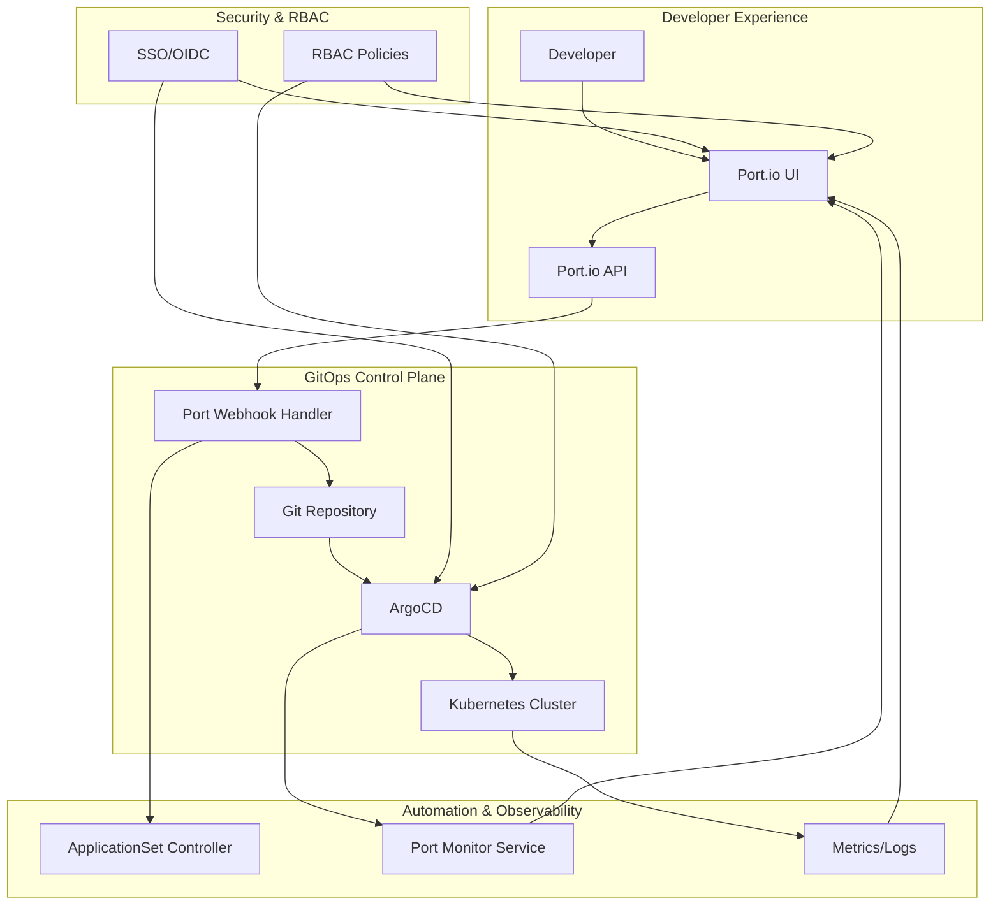

# Port.io + ArgoCD Integration Architecture

## 🏗️ Architecture Overview



## 🔄 Integration Flow

### 1. Self-Service Request Flow
```
Developer Request (Port.io) 
    ↓
Port.io Action Execution
    ↓
Webhook to GitOps Controller
    ↓
Git Commit (YAML Generation)
    ↓
ArgoCD Detects Changes
    ↓
Application Deployment
    ↓
Status Sync back to Port.io
```

### 2. Data Flow Components

| Component | Purpose | Integration Point |
|-----------|---------|-------------------|
| **Port.io UI** | Self-service interface | Developer portal |
| **Port Actions** | Workflow automation | Webhook triggers |
| **GitOps Controller** | Git operations | Kubernetes operator |
| **ArgoCD** | Deployment engine | K8s applications |
| **ApplicationSets** | Template management | Multi-env deployments |
| **Port Exporter** | Status synchronization | Real-time monitoring |

### 3. Security Integration Points

- **OIDC Provider**: Shared SSO for Port.io and ArgoCD
- **RBAC Mapping**: Port roles → ArgoCD permissions
- **API Authentication**: Service accounts for automation
- **Audit Logging**: All actions tracked and correlated

## 🎯 Key Benefits

1. **Developer Self-Service**: No ops team bottlenecks
2. **GitOps Compliance**: All changes via Git
3. **Security Enforcement**: Automated RBAC and approvals
4. **Unified Experience**: Single pane of glass
5. **Audit Trail**: Complete action history
6. **Template Management**: Standardized deployments
