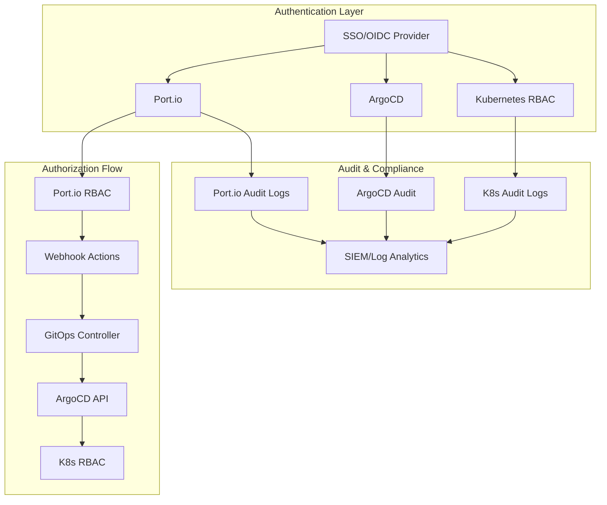

# Port.io + ArgoCD RBAC & Security Configuration

## 🔐 Security Integration Architecture



## 🎭 Role Mapping Matrix

| Port.io Role | ArgoCD Project Role | Kubernetes RBAC | Permissions |
|--------------|-------------------|-----------------|-------------|
| **Developer** | `developer` | `developer` | • View all apps<br>• Sync dev apps<br>• Scale dev resources |
| **Platform Engineer** | `platform-engineer` | `platform-admin` | • Manage all environments<br>• Create/delete applications<br>• Configure AppSets |
| **SRE** | `sre` | `sre` | • View all apps<br>• Emergency sync prod<br>• Rollback capabilities |
| **Service Owner** | `service-owner` | `service-{name}` | • Manage own service<br>• All environments for owned service<br>• Resource scaling |
| **Security Team** | `security-readonly` | `security-viewer` | • Read-only access<br>• Security scan results<br>• Compliance reports |

## 🔒 RBAC Configuration Files

### Port.io Team Mapping
```yaml
apiVersion: v1
kind: ConfigMap
metadata:
  name: port-rbac-config
  namespace: port-system
data:
  rbac-mapping.yaml: |
    # Port.io to ArgoCD role mapping
    roleMappings:
      developer:
        argocdRole: "proj:microservices:developer"
        kubernetesGroups: ["developers"]
        permissions:
          - "applications:get:*"
          - "applications:sync:*-dev"
          - "applications:action/*:*-dev"
      
      platform-engineer:
        argocdRole: "proj:microservices:platform-engineer"
        kubernetesGroups: ["platform-team"]
        permissions:
          - "applications:*:*"
          - "repositories:*:*"
          - "clusters:get:*"
      
      sre:
        argocdRole: "proj:microservices:sre"
        kubernetesGroups: ["sre-team"]
        permissions:
          - "applications:get:*"
          - "applications:sync:*-prod"
          - "applications:action/rollback:*-prod"
      
      service-owner:
        argocdRole: "proj:microservices:service-owner"
        kubernetesGroups: ["service-owners"]
        permissions:
          - "applications:*:{{.Values.serviceName}}-*"
    
    # Team to service ownership mapping
    serviceOwnership:
      backend-team:
        services: ["user-service", "auth-service", "payment-service"]
      frontend-team:
        services: ["web-app", "mobile-api"]
      data-team:
        services: ["analytics-service", "etl-pipeline"]
```

### Kubernetes RBAC for Teams
```yaml
apiVersion: rbac.authorization.k8s.io/v1
kind: ClusterRole
metadata:
  name: developer-role
rules:
- apiGroups: [""]
  resources: ["pods", "services", "configmaps"]
  verbs: ["get", "list", "watch"]
- apiGroups: ["apps"]
  resources: ["deployments", "replicasets"]
  verbs: ["get", "list", "watch", "patch"]
  resourceNames: ["*-dev-*"]
- apiGroups: ["argoproj.io"]
  resources: ["applications"]
  verbs: ["get", "list", "patch"]
  resourceNames: ["*-dev"]

---
apiVersion: rbac.authorization.k8s.io/v1
kind: ClusterRole
metadata:
  name: platform-admin-role
rules:
- apiGroups: ["*"]
  resources: ["*"]
  verbs: ["*"]

---
apiVersion: rbac.authorization.k8s.io/v1
kind: ClusterRole
metadata:
  name: sre-role
rules:
- apiGroups: [""]
  resources: ["pods", "services", "events"]
  verbs: ["get", "list", "watch"]
- apiGroups: ["apps"]
  resources: ["deployments"]
  verbs: ["get", "list", "watch", "patch"]
- apiGroups: ["argoproj.io"]
  resources: ["applications"]
  verbs: ["get", "list", "patch"]
- apiGroups: ["argoproj.io"]
  resources: ["applications"]
  verbs: ["sync"]
  resourceNames: ["*-prod"]

---
# Service-specific RBAC (template)
apiVersion: rbac.authorization.k8s.io/v1
kind: Role
metadata:
  namespace: prod
  name: service-owner-user-service
rules:
- apiGroups: ["apps"]
  resources: ["deployments"]
  verbs: ["get", "list", "watch", "patch"]
  resourceNames: ["user-service"]
- apiGroups: [""]
  resources: ["pods", "services"]
  verbs: ["get", "list", "watch"]
  labelSelectors: ["app=user-service"]
```

## 🔐 SSO Integration Configuration

### ArgoCD OIDC Configuration (Updated)
```yaml
# Add to argocd-server-ha.yaml
data:
  # OIDC configuration with Port.io integration
  oidc.config: |
    name: Corporate SSO
    issuer: https://your-oidc-provider.com
    clientId: argocd
    clientSecret: $oidc.clientSecret
    requestedScopes: ["openid", "profile", "email", "groups"]
    requestedIDTokenClaims: 
      groups: 
        essential: true
      email:
        essential: true
    # Group mapping for Port.io teams
    groupClaim: "groups"
    # ArgoCD URL for proper redirects
    redirectURI: "http://argo.annkinimbom.com/auth/callback"
  
  # Policy for group-based access
  policy.default: role:readonly
  policy.csv: |
    # Developer access
    g, your-org:developers, role:developer
    g, your-org:backend-team, role:developer
    g, your-org:frontend-team, role:developer
    
    # Platform team access
    g, your-org:platform-team, role:admin
    g, your-org:devops-team, role:admin
    
    # SRE access
    g, your-org:sre-team, role:sre
    
    # Service owner access (dynamic based on Port.io)
    g, service-owner:user-service, role:service-owner
    g, service-owner:payment-service, role:service-owner
```

### Port.io SSO Configuration
```json
{
  "sso": {
    "provider": "oidc",
    "config": {
      "issuer": "https://your-oidc-provider.com",
      "clientId": "port-io",
      "clientSecret": "${SSO_CLIENT_SECRET}",
      "scopes": ["openid", "profile", "email", "groups"],
      "groupsClaim": "groups",
      "autoCreateUsers": true,
      "roleMapping": {
        "your-org:developers": ["Developer"],
        "your-org:platform-team": ["Admin"],
        "your-org:sre-team": ["SRE"],
        "your-org:security-team": ["Security"]
      }
    }
  }
}
```

## 🛡️ Security Policies

### Port.io Action Approval Matrix
```yaml
apiVersion: v1
kind: ConfigMap
metadata:
  name: port-approval-policies
  namespace: port-system
data:
  approval-policies.yaml: |
    # Approval requirements by action and environment
    approvalPolicies:
      create_microservice:
        required: false
        approvers: []
      
      deploy_to_environment:
        dev:
          required: false
        staging:
          required: true
          approvers: ["platform-team"]
          minApprovals: 1
        prod:
          required: true
          approvers: ["platform-team", "sre-team"]
          minApprovals: 2
          requiresSecurityReview: true
      
      promote_deployment:
        staging:
          required: true
          approvers: ["service-owner", "platform-team"]
          minApprovals: 1
        prod:
          required: true
          approvers: ["platform-team", "sre-team"]
          minApprovals: 2
          requiresChangeManagement: true
      
      rollback_deployment:
        dev:
          required: false
        staging:
          required: true
          approvers: ["service-owner", "platform-team"]
          minApprovals: 1
        prod:
          required: true
          approvers: ["sre-team"]
          minApprovals: 1
          emergencyOverride: true
      
      scale_resources:
        dev:
          required: false
          maxReplicas: 5
          maxCPU: "1000m"
          maxMemory: "2Gi"
        staging:
          required: true
          approvers: ["platform-team"]
          maxReplicas: 10
          maxCPU: "2000m"
          maxMemory: "4Gi"
        prod:
          required: true
          approvers: ["platform-team", "sre-team"]
          minApprovals: 2
          maxReplicas: 20
          maxCPU: "4000m"
          maxMemory: "8Gi"
```

### Network Policies for Security
```yaml
apiVersion: networking.k8s.io/v1
kind: NetworkPolicy
metadata:
  name: port-system-policy
  namespace: port-system
spec:
  podSelector: {}
  policyTypes:
  - Ingress
  - Egress
  ingress:
  - from:
    - namespaceSelector:
        matchLabels:
          name: argocd
    - namespaceSelector:
        matchLabels:
          name: prod
    - namespaceSelector:
        matchLabels:
          name: staging
    - namespaceSelector:
        matchLabels:
          name: dev
  egress:
  - to: []
    ports:
    - protocol: TCP
      port: 443  # HTTPS to Port.io API
    - protocol: TCP
      port: 80   # HTTP to ArgoCD
  - to:
    - namespaceSelector:
        matchLabels:
          name: argocd
    ports:
    - protocol: TCP
      port: 80
    - protocol: TCP
      port: 443

---
# Environment isolation
apiVersion: networking.k8s.io/v1
kind: NetworkPolicy
metadata:
  name: environment-isolation
  namespace: prod
spec:
  podSelector: {}
  policyTypes:
  - Ingress
  - Egress
  ingress:
  - from:
    - namespaceSelector:
        matchLabels:
          name: prod
  - from:
    - namespaceSelector:
        matchLabels:
          name: port-system
    ports:
    - protocol: TCP
      port: 8080
  egress:
  - to:
    - namespaceSelector:
        matchLabels:
          name: prod
```

## 📊 Audit & Observability

### Audit Log Configuration
```yaml
apiVersion: v1
kind: ConfigMap
metadata:
  name: audit-config
  namespace: port-system
data:
  audit-policy.yaml: |
    # Audit policy for Port.io actions
    apiVersion: audit.k8s.io/v1
    kind: Policy
    rules:
    # Log all Port.io webhook calls
    - level: RequestResponse
      resources:
      - group: ""
        resources: ["services"]
      namespaces: ["port-system"]
      annotationSelector:
        matchLabels:
          "port.io/action": "*"
    
    # Log ArgoCD application changes
    - level: RequestResponse
      resources:
      - group: "argoproj.io"
        resources: ["applications"]
      verbs: ["create", "update", "patch", "delete"]
    
    # Log deployment scaling events
    - level: RequestResponse
      resources:
      - group: "apps"
        resources: ["deployments"]
      verbs: ["patch", "update"]
      annotationSelector:
        matchLabels:
          "port.io/scaled": "*"

  fluentd-config.conf: |
    # Fluentd configuration for audit log shipping
    <source>
      @type tail
      path /var/log/audit.log
      pos_file /var/log/fluentd-audit.log.pos
      tag kubernetes.audit
      format json
      time_key timestamp
      time_format %Y-%m-%dT%H:%M:%S.%NZ
    </source>
    
    <filter kubernetes.audit>
      @type grep
      <regexp>
        key objectRef.name
        pattern ^port-.*
      </regexp>
    </filter>
    
    <match kubernetes.audit>
      @type forward
      <server>
        host siem-server
        port 24224
      </server>
    </match>
```

### Monitoring Dashboard Configuration
```yaml
apiVersion: v1
kind: ConfigMap
metadata:
  name: port-monitoring-config
  namespace: port-system
data:
  grafana-dashboard.json: |
    {
      "dashboard": {
        "title": "Port.io GitOps Metrics",
        "panels": [
          {
            "title": "Deployment Success Rate",
            "type": "stat",
            "targets": [
              {
                "expr": "rate(port_deployments_total{status=\"success\"}[5m]) / rate(port_deployments_total[5m]) * 100"
              }
            ]
          },
          {
            "title": "Average Deployment Time",
            "type": "stat",
            "targets": [
              {
                "expr": "avg(port_deployment_duration_seconds)"
              }
            ]
          },
          {
            "title": "Active Applications by Environment",
            "type": "piechart",
            "targets": [
              {
                "expr": "count by (environment) (argocd_app_health_status)"
              }
            ]
          },
          {
            "title": "Approval Wait Times",
            "type": "graph",
            "targets": [
              {
                "expr": "histogram_quantile(0.95, rate(port_approval_duration_seconds_bucket[5m]))"
              }
            ]
          }
        ]
      }
    }
```

## 🚨 Security Best Practices

### 1. Principle of Least Privilege
- **Port.io Actions**: Only grant minimum required permissions
- **Service Accounts**: Use dedicated service accounts for each component
- **Network Policies**: Restrict traffic between namespaces

### 2. Secrets Management
```yaml
# Use external secrets operator
apiVersion: external-secrets.io/v1beta1
kind: SecretStore
metadata:
  name: port-secrets
  namespace: port-system
spec:
  provider:
    vault:
      server: "https://vault.company.com"
      path: "secret"
      version: "v2"
      auth:
        kubernetes:
          mountPath: "kubernetes"
          role: "port-system"

---
apiVersion: external-secrets.io/v1beta1
kind: ExternalSecret
metadata:
  name: port-credentials
  namespace: port-system
spec:
  refreshInterval: 1h
  secretStoreRef:
    name: port-secrets
    kind: SecretStore
  target:
    name: port-credentials
    creationPolicy: Owner
  data:
  - secretKey: client-id
    remoteRef:
      key: port-io
      property: client-id
  - secretKey: client-secret
    remoteRef:
      key: port-io
      property: client-secret
```

### 3. Compliance & Governance
- **Change Management**: All prod changes require approval
- **Audit Trail**: Complete logging of all actions
- **Security Scanning**: Automated security checks in CI/CD
- **Compliance Checks**: SOX, PCI, HIPAA compliance validations

### 4. Emergency Procedures
```yaml
# Emergency access role for SRE
apiVersion: rbac.authorization.k8s.io/v1
kind: ClusterRole
metadata:
  name: emergency-access
rules:
- apiGroups: ["*"]
  resources: ["*"]
  verbs: ["*"]

---
# Emergency break-glass procedure
apiVersion: v1
kind: ConfigMap
metadata:
  name: emergency-procedures
  namespace: port-system
data:
  break-glass.sh: |
    #!/bin/bash
    # Emergency break-glass access
    # This script grants temporary emergency access and logs the action
    
    echo "EMERGENCY ACCESS ACTIVATED at $(date)" | tee -a /var/log/emergency.log
    echo "User: $USER" | tee -a /var/log/emergency.log
    echo "Reason: $1" | tee -a /var/log/emergency.log
    
    # Grant emergency access
    kubectl create clusterrolebinding emergency-$USER \
      --clusterrole=emergency-access \
      --user=$USER
    
    # Set expiration (4 hours)
    echo "Emergency access expires at $(date -d '+4 hours')" | tee -a /var/log/emergency.log
    
    # Schedule automatic revocation
    echo "kubectl delete clusterrolebinding emergency-$USER" | at now + 4 hours
```

This comprehensive RBAC and security configuration ensures that your Port.io + ArgoCD integration maintains enterprise-grade security while enabling developer self-service capabilities.
