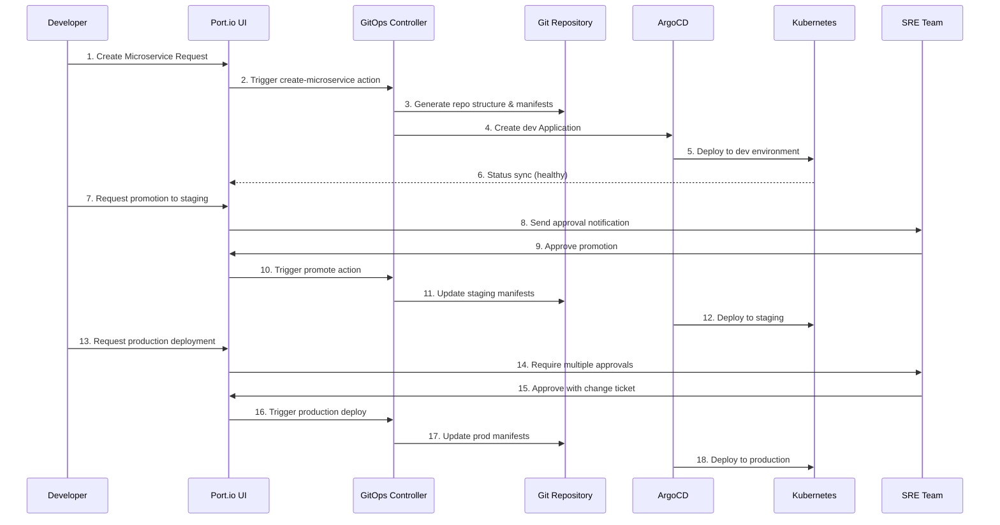

# Complete Port.io + ArgoCD Use Case Example

## 🎯 Scenario: New Microservice Deployment

**Business Context**: A developer wants to create a new payment processing microservice and deploy it through all environments using Port.io's self-service platform.

### 👤 Personas & Workflow



## 📋 Step-by-Step Implementation

### Step 1: Developer Self-Service Request

**Developer Action in Port.io:**
```json
{
  "action": "create_microservice",
  "inputs": {
    "name": "payment-service",
    "team": "backend-team",
    "language": "java",
    "framework": "spring-boot",
    "template": "api-service",
    "port": 8080,
    "database": true,
    "redis": false,
    "public": true
  }
}
```

**Generated Git Repository Structure:**
```
services/payment-service/
├── README.md
├── Dockerfile
├── .github/
│   └── workflows/
│       └── ci-cd.yaml
├── base/
│   ├── deployment.yaml
│   ├── service.yaml
│   ├── configmap.yaml
│   ├── secret.yaml
│   └── kustomization.yaml
└── overlays/
    ├── dev/
    │   ├── kustomization.yaml
    │   ├── replica-patch.yaml
    │   └── resource-patch.yaml
    ├── staging/
    │   ├── kustomization.yaml
    │   ├── replica-patch.yaml
    │   └── resource-patch.yaml
    └── prod/
        ├── kustomization.yaml
        ├── replica-patch.yaml
        ├── resource-patch.yaml
        └── network-policy.yaml
```

### Step 2: Generated Kubernetes Manifests

**Base Deployment (`base/deployment.yaml`):**
```yaml
apiVersion: apps/v1
kind: Deployment
metadata:
  name: payment-service
  labels:
    app: payment-service
    tier: backend
    team: backend-team
    managed-by: port-io
  annotations:
    port.io/entity: payment-service
    port.io/blueprint: microservice
spec:
  replicas: 2
  selector:
    matchLabels:
      app: payment-service
  template:
    metadata:
      labels:
        app: payment-service
        version: v1.0.0
      annotations:
        prometheus.io/scrape: "true"
        prometheus.io/port: "8080"
        prometheus.io/path: "/actuator/prometheus"
    spec:
      serviceAccountName: payment-service
      securityContext:
        runAsNonRoot: true
        runAsUser: 65534
        fsGroup: 65534
      containers:
      - name: payment-service
        image: localhost:5000/payment-service:v1.0.0
        ports:
        - containerPort: 8080
          name: http
          protocol: TCP
        env:
        - name: SPRING_PROFILES_ACTIVE
          value: "kubernetes"
        - name: DB_HOST
          valueFrom:
            secretKeyRef:
              name: payment-service-secrets
              key: db-host
        - name: DB_USERNAME
          valueFrom:
            secretKeyRef:
              name: payment-service-secrets
              key: db-username
        - name: DB_PASSWORD
          valueFrom:
            secretKeyRef:
              name: payment-service-secrets
              key: db-password
        resources:
          requests:
            cpu: 200m
            memory: 512Mi
            ephemeral-storage: 1Gi
          limits:
            cpu: 1000m
            memory: 1Gi
            ephemeral-storage: 2Gi
        securityContext:
          allowPrivilegeEscalation: false
          readOnlyRootFilesystem: true
          runAsNonRoot: true
          runAsUser: 65534
          capabilities:
            drop:
            - ALL
        livenessProbe:
          httpGet:
            path: /actuator/health/liveness
            port: 8080
          initialDelaySeconds: 60
          periodSeconds: 10
          timeoutSeconds: 5
          failureThreshold: 3
        readinessProbe:
          httpGet:
            path: /actuator/health/readiness
            port: 8080
          initialDelaySeconds: 30
          periodSeconds: 5
          timeoutSeconds: 3
          failureThreshold: 3
        volumeMounts:
        - name: tmp
          mountPath: /tmp
        - name: config
          mountPath: /app/config
      volumes:
      - name: tmp
        emptyDir:
          sizeLimit: 1Gi
      - name: config
        configMap:
          name: payment-service-config
```

**Environment-Specific Kustomization (`overlays/prod/kustomization.yaml`):**
```yaml
apiVersion: kustomize.config.k8s.io/v1beta1
kind: Kustomization

namespace: prod

resources:
- ../../base

images:
- name: localhost:5000/payment-service
  newTag: v1.2.0

patches:
- path: replica-patch.yaml
- path: resource-patch.yaml

configMapGenerator:
- name: payment-service-config
  literals:
  - ENVIRONMENT=production
  - LOG_LEVEL=INFO
  - METRICS_ENABLED=true

secretGenerator:
- name: payment-service-secrets
  type: Opaque
  literals:
  - db-host=prod-postgres.db.svc.cluster.local
  - db-username=payment_user
  - db-password=ENCRYPTED_PASSWORD

resources:
- network-policy.yaml
```

### Step 3: ArgoCD Application Generated

**Production Application (`argocd/apps/payment-service-prod.yaml`):**
```yaml
apiVersion: argoproj.io/v1alpha1
kind: Application
metadata:
  name: payment-service-prod
  namespace: argocd
  labels:
    app.kubernetes.io/name: payment-service
    app.kubernetes.io/environment: prod
    managed-by: port-io
    team: backend-team
  annotations:
    port.io/entity: payment-service
    port.io/environment: prod
    argocd.argoproj.io/sync-wave: "2"
    notifications.argoproj.io/subscribe.on-sync-succeeded.port: ""
    notifications.argoproj.io/subscribe.on-sync-failed.port: ""
    notifications.argoproj.io/subscribe.on-health-degraded.port: ""
spec:
  project: microservices
  source:
    repoURL: https://github.com/your-org/gitops-manifests.git
    targetRevision: HEAD
    path: services/payment-service/overlays/prod
  destination:
    server: https://kubernetes.default.svc
    namespace: prod
  syncPolicy:
    automated:
      prune: true
      selfHeal: false  # Manual sync for prod
    syncOptions:
    - CreateNamespace=true
    - PrunePropagationPolicy=foreground
    - PruneLast=true
    - RespectIgnoreDifferences=true
    retry:
      limit: 3
      backoff:
        duration: 5s
        factor: 2
        maxDuration: 3m
  ignoreDifferences:
  - group: apps
    kind: Deployment
    jsonPointers:
    - /spec/replicas
  - group: ""
    kind: Secret
    jsonPointers:
    - /data
  revisionHistoryLimit: 10
```

### Step 4: Port.io Entity Updates

**Created Microservice Entity:**
```json
{
  "identifier": "payment-service",
  "blueprint": "microservice",
  "properties": {
    "name": "payment-service",
    "team": "backend-team",
    "language": "java",
    "framework": "spring-boot",
    "port": 8080,
    "status": "active",
    "repository": "https://github.com/your-org/gitops-manifests/tree/main/services/payment-service",
    "created_at": "2025-08-04T10:30:00Z"
  },
  "relations": {
    "team": "backend-team"
  }
}
```

**Created Deployment Entities:**
```json
[
  {
    "identifier": "payment-service-dev",
    "blueprint": "deployment", 
    "properties": {
      "service": "payment-service",
      "environment": "dev",
      "version": "v1.0.0",
      "status": "Healthy",
      "sync_status": "Synced",
      "replicas": 1,
      "ready_replicas": 1,
      "auto_sync": true,
      "deployed_at": "2025-08-04T10:35:00Z"
    },
    "relations": {
      "service": "payment-service",
      "environment": "dev"
    }
  },
  {
    "identifier": "payment-service-staging",
    "blueprint": "deployment",
    "properties": {
      "service": "payment-service", 
      "environment": "staging",
      "version": "v1.1.0",
      "status": "Healthy",
      "sync_status": "Synced",
      "replicas": 2,
      "ready_replicas": 2,
      "auto_sync": true,
      "promoted_from": "dev",
      "deployed_at": "2025-08-04T11:15:00Z"
    },
    "relations": {
      "service": "payment-service",
      "environment": "staging"
    }
  },
  {
    "identifier": "payment-service-prod",
    "blueprint": "deployment",
    "properties": {
      "service": "payment-service",
      "environment": "prod", 
      "version": "v1.2.0",
      "status": "Healthy",
      "sync_status": "Synced",
      "replicas": 5,
      "ready_replicas": 5,
      "auto_sync": false,
      "promoted_from": "staging",
      "change_ticket": "CHG-12345",
      "deployed_at": "2025-08-04T15:30:00Z"
    },
    "relations": {
      "service": "payment-service",
      "environment": "prod"
    }
  }
]
```

## 🔄 Operational Workflows

### Promotion Workflow
```yaml
# Promote from staging to prod
POST /webhooks/promote
{
  "action": "promote_deployment",
  "entity": {
    "identifier": "payment-service-staging",
    "blueprint": "deployment"
  },
  "properties": {
    "target_environment": "prod",
    "run_tests": true,
    "change_ticket": "CHG-12345"
  },
  "context": {
    "userEmail": "developer@company.com",
    "runId": "run_12345"
  }
}
```

### Rollback Workflow
```yaml
# Emergency rollback in production
POST /webhooks/rollback
{
  "action": "rollback_deployment", 
  "entity": {
    "identifier": "payment-service-prod",
    "blueprint": "deployment"
  },
  "properties": {
    "target_version": "v1.1.0",
    "reason": "Critical bug in payment processing"
  },
  "context": {
    "userEmail": "sre@company.com",
    "runId": "emergency_67890"
  }
}
```

### Scaling Workflow
```yaml
# Scale production resources during peak traffic
POST /webhooks/scale
{
  "action": "scale_resources",
  "entity": {
    "identifier": "payment-service-prod", 
    "blueprint": "deployment"
  },
  "properties": {
    "replicas": 10,
    "cpu_limit": "2000m",
    "memory_limit": "2Gi",
    "reason": "Black Friday traffic surge"
  },
  "context": {
    "userEmail": "platform@company.com",
    "runId": "scale_11111"
  }
}
```

## 📊 Monitoring & Observability

### Port.io Dashboard Views

**Service Catalog View:**
- All microservices with health status
- Team ownership mapping
- Environment deployment status
- Recent activity timeline

**Deployment Pipeline View:**
- Environment promotion flow
- Approval requirements and status
- Deployment success/failure rates
- Lead time metrics

**Resource Management View:**
- Current resource allocation
- Scaling history and trends
- Cost optimization recommendations
- Performance metrics

### ArgoCD Integration Points

**Status Synchronization:**
- Application health → Port.io deployment status
- Sync status → Port.io sync status  
- Resource metrics → Port.io resource properties
- Deployment events → Port.io activity timeline

**Webhook Notifications:**
```yaml
# ArgoCD notification configuration
apiVersion: v1
kind: ConfigMap
metadata:
  name: argocd-notifications-cm
  namespace: argocd
data:
  service.webhook.port: |
    url: http://port-gitops-controller.port-system.svc.cluster.local:8080/webhooks/argocd
    headers:
    - name: Content-Type
      value: application/json
  
  template.app-sync-succeeded: |
    webhook:
      port:
        method: POST
        body: |
          {
            "entity": "{{.app.metadata.annotations.port\\.io/entity}}",
            "blueprint": "deployment",
            "properties": {
              "status": "Healthy",
              "sync_status": "Synced",
              "last_sync": "{{.app.status.operationState.finishedAt}}",
              "revision": "{{.app.status.sync.revision}}"
            }
          }
  
  template.app-health-degraded: |
    webhook:
      port:
        method: POST
        body: |
          {
            "entity": "{{.app.metadata.annotations.port\\.io/entity}}", 
            "blueprint": "deployment",
            "properties": {
              "status": "Degraded",
              "health_message": "{{.app.status.health.message}}",
              "degraded_at": "{{.time}}"
            }
          }
```

## 🎯 Benefits Realized

### For Developers:
- **Self-Service**: Create and deploy services without waiting for ops
- **Consistency**: Standardized templates and best practices
- **Visibility**: Real-time status of all deployments
- **Safety**: Built-in approvals and rollback capabilities

### For Platform Teams:
- **Governance**: Centralized policies and approvals
- **Standardization**: Consistent deployment patterns
- **Observability**: Complete audit trail and metrics
- **Scalability**: Handles hundreds of services and developers

### For SRE Teams:
- **Control**: Emergency access and rollback capabilities
- **Monitoring**: Centralized view of all applications
- **Compliance**: Automated approval workflows
- **Efficiency**: Reduced manual intervention

This complete example demonstrates how Port.io and ArgoCD integration enables true self-service GitOps while maintaining enterprise-grade security, governance, and observability! 🚀
